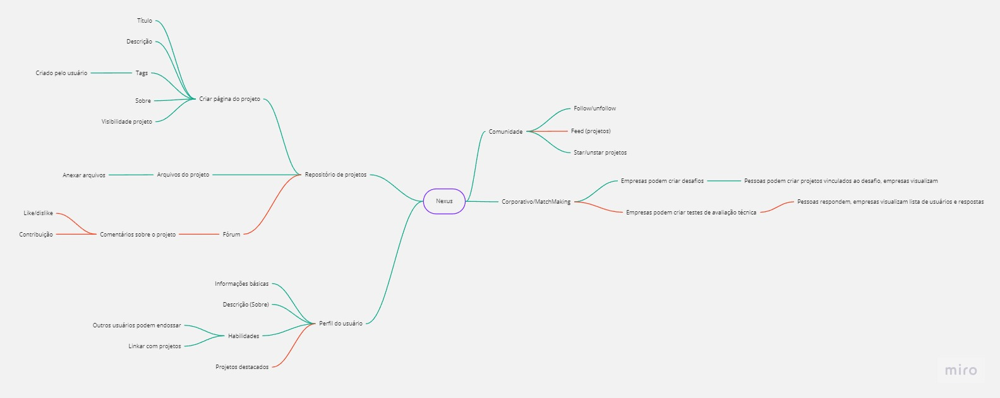

# Resume

# Nexus API (Hackathon Samba Meets)

API developed in C# ASP .NET Core 7, feeds and consumes the SQL database.

## Requisitos

Certifique-se de ter as seguintes ferramentas instaladas em seu sistema local:

- AspNetCore 7 SDK: [Link to download](https://dotnet.microsoft.com/download/dotnet/7.0)
- SQL Server: 
- Git: [Link to download](https://git-scm.com/downloads)

# Project Map



# Database Model


# Configuration

1. Clone the repository:

```bash
git clone https://github.com/GustavoAV2/MathMastery.git
```

2. Access the project directory:

```bash
cd Nexus.Api
```

3. Restore project dependencies:

```bash
dotnet restore
```

4. Create, migrate and update Database

```PM
Add-Migration DbMigrate -Context UserDb

Update-Database -Context UserDb
```

5. Compile and execute the `Nexus.Api` project .

---

The server will be available at https://localhost:7224/ by default.

## Endpoints da API

- `GET /api/exemplo`: Return all.
- `GET /api/exemplo/{id}`: Retorna o exemplo com o ID fornecido.
- `POST /api/exemplo`: Cria um novo exemplo.
- `PUT /api/exemplo/{id}`: Atualiza o exemplo com o ID fornecido.
- `DELETE /api/exemplo/{id}`: Remove o exemplo com o ID fornecido.

## License

### MIT License

Copyright (c) 2023 Gustavo Voltolini

Permission is hereby granted, free of charge, to any person obtaining a copy
of this software and associated documentation files (the "Software"), to deal
in the Software without restriction, including without limitation the rights
to use, copy, modify, merge, publish, distribute, sublicense, and/or sell
copies of the Software, and to permit persons to whom the Software is
furnished to do so, subject to the following conditions:

The above copyright notice and this permission notice shall be included in all

## Contato

For questions or suggestions, please feel free to get in touch:

- Name: Gustavo Antunes Voltolini

  E-mail: gustavoant.voltolini@gmail.com
  
  [Perfil Linkedin](https://www.linkedin.com/in/gustavo-voltolini/)

- Name: Rafael Mendes De Carvalho

  E-mail: rafaelmendes0606@gmail.com

  [Perfil Linkedin](https://www.linkedin.com/in/rafael-mendes-919755178/)

- Name: Joshua Patrick Loesch Alves

  E-mail: joshualoesch@gmail.com

  [Linkedin](https://www.linkedin.com/in/joshuaalves/)


THE SOFTWARE IS PROVIDED "AS IS", WITHOUT WARRANTY OF ANY KIND, EXPRESS OR
IMPLIED, INCLUDING BUT NOT LIMITED TO THE WARRANTIES OF MERCHANTABILITY,
FITNESS FOR A PARTICULAR PURPOSE AND NONINFRINGEMENT. IN NO EVENT SHALL THE
AUTHORS OR COPYRIGHT HOLDERS BE LIABLE FOR ANY CLAIM, DAMAGES OR OTHER
LIABILITY, WHETHER IN AN ACTION OF CONTRACT, TORT OR OTHERWISE, ARISING FROM,
OUT OF OR IN CONNECTION WITH THE SOFTWARE OR THE USE OR OTHER DEALINGS IN THE
SOFTWARE.
