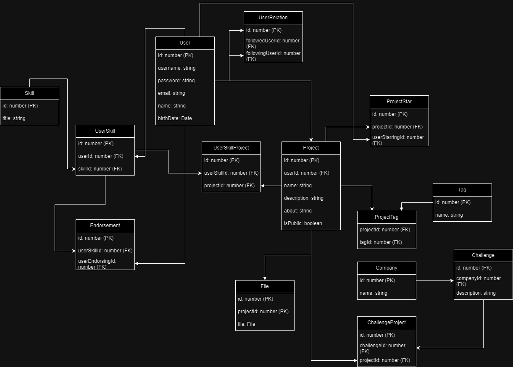

# nexus-api

API Hackathon Samba Meets

# Modelo do Banco de dados

# Migrate and Update Database
`Add-Migration UserMigrate -Context UserDb`

`Add-Migration UserMigrate -Context CompanyDb`

`Add-Migration UserMigrate -Context ProjectDb`

---

`Update-Database -Context UserDb`

`Update-Database -Context ProjectDb`

`Update-Database -Context CompanyDb`
